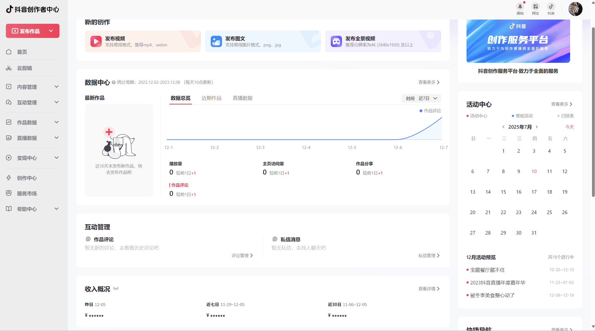

# 抖音全栈项目

这是一个模仿抖音的全栈项目，采用 monorepo 架构，使用 pnpm 工作空间管理。项目包含三个主要子应用：用户端、创作者平台和管理后台。当前这三个项目的进度分别为：
- 用户端：50% （完成大部分前端页面的ui和实现部分功能调用抖音接口）
- 创作者平台：10% （只完成少部分ui和功能，暂未对接后端）
- 管理后台：10% （只完成少部分ui和功能， 暂未对接后端）


## 项目结构

```
douyin/
├── packages/
│   ├── douyin-portal/   
│   ├── douyin-creator/  
│   └── douyin-admin/    
```

## 技术栈

### 用户端 (douyin-portal)

- Vue 3
- TypeScript
- Vite
- Pinia 状态管理
- Element Plus UI
- Vue Router
- xgplayer 视频播放器

### 创作者平台 (douyin-creator)

- React 18
- TypeScript
- Vite
- Semi UI (字节跳动的 UI 库)
- React Router
- zustand 状态管理
- 数据可视化：@antv/g2, bizcharts
- 图像处理：fabric.js, react-image-crop

### 管理后台 (douyin-admin)

- React 18
- TypeScript
- Vite
- Arco Design UI (字节跳动的企业级设计系统)
- React Router
- Redux 状态管理
- bizcharts 数据可视化

## 主要功能

### 用户端功能 (douyin-portal)

1. 视频功能

   - 基于 xgplayer 的视频播放器，支持多种播放模式（基础播放、迷你播放、模态框播放、滑动播放）
   - 视频操作栏（点赞、评论、分享）
   - 视频信息展示
   - 视频列表和侧边栏推荐
   - 视频进度条控制

2. 用户系统

   - 多种登录方式（二维码、验证码、密码）
   - 用户主页（作品、点赞、收藏）
   - 用户关注和粉丝管理
   - 个人中心设置

3. 社交互动

   - 评论系统（支持表情、@用户）
   - 私信系统
   - 消息通知
   - 用户关注

4. 发现页

   - 分类浏览
   - 热门推荐
   - 最新内容
   - 个性化推荐

5. 搜索系统

   - 搜索建议
   - 搜索结果展示
   - 热门搜索


6. 接口调用
   - 请参考项目 https://github.com/mafqla/douyin-api

### 创作者平台功能 (douyin-creator)

1. 内容创作与管理

   - 视频上传和发布系统
   - 内容编辑器（支持图像裁剪、编辑）
   - 合集管理和创建
   - 原创保护设置
   - 素材库管理

2. 数据分析与可视化

   - 多种数据图表展示（面积图、折线图、饼图、柱状图）
   - 粉丝数据分析和画像
   - 视频表现数据
   - 互动数据统计（评论、点赞、分享）
   - 数据周报生成

3. 直播管理

   - 直播数据概览
   - 直播回放管理
   - 直播互动分析
   - 直播收益统计

4. 收益管理

   - 收益概览和趋势
   - 收益来源分析
   - 结算记录
   - 收益提现

5. 创作辅助工具
   - 市场趋势分析
   - 创作指导和建议
   - 热门话题推荐
   - 创作规范指南

### 管理后台功能 (douyin-admin)

1. 系统管理

   - 基于 RBAC 的权限管理系统
   - 用户管理（创建、编辑、删除、状态管理）
   - 角色权限配置
   - 动态菜单管理
   - 系统设置（主题、布局、配色方案）

2. 数据分析与可视化

   - 多维数据分析仪表板
   - 实时数据监控
   - 多种图表展示（面积图、折线图、饼图、柱状图）
   - 自定义数据报表
   - 数据导出功能

3. 监控中心

   - 实时用户行为监控
   - 系统性能监控（CPU、内存、磁盘使用率）
   - 登录日志和安全审计
   - 操作日志记录
   - 异常监控和告警

4. 内容管理

   - 视频内容审核
   - 用户举报处理
   - 评论管理
   - 敏感词过滤
   - 内容推荐配置

5. 运营管理
   - 活动管理
   - 广告投放
   - 用户反馈处理
   - 系统公告发布
   - 数据统计报表

## 项目亮点

1. 技术栈现代化

   - 基于 Vue 3 和 React 18 的最新技术栈
   - TypeScript 保证代码质量和类型安全
   - Vite 构建工具提供极速开发体验
   - Monorepo 架构便于代码共享和统一管理

2. 优秀的用户体验

   - 流畅的视频播放和切换
   - 响应式设计适配多种设备
   - 优化的虚拟列表和懒加载
   - 丰富的交互动画效果

3. 强大的数据分析

   - 多维度数据可视化
   - 实时数据监控
   - 自定义数据报表
   - 智能数据分析

4. 安全性

   - RBAC 权限管理
   - 操作日志审计
   - 敏感数据加密
   - XSS/CSRF 防护

5. 可扩展性
   - 模块化设计
   - 插件化架构
   - 统一的状态管理
   - 标准化的接口规范


## 环境要求

- Node.js 16+
- pnpm 包管理器

## 开发指南

### 环境准备

1. 安装 Node.js (推荐 v16.x 或更高版本)
2. 安装 pnpm
   ```bash
   npm install -g pnpm
   ```

### 安装依赖

```bash
# 安装所有依赖
pnpm install

# 安装单个项目依赖
pnpm --filter @douyin/portal install
pnpm --filter @douyin/creator install
pnpm --filter @douyin/admin install
```

### 启动开发服务器

用户端：

```bash
# 方式 1：在根目录运行
pnpm portal

# 方式 2：进入项目目录运行
cd packages/douyin-portal
pnpm dev
```

创作者平台：

```bash
# 方式 1：在根目录运行
pnpm creator

# 方式 2：进入项目目录运行
cd packages/douyin-creator
pnpm dev
```

管理后台：

```bash
# 方式 1：在根目录运行
pnpm admin

# 方式 2：进入项目目录运行
cd packages/douyin-admin
pnpm dev
```

### 构建项目

```bash
# 构建用户端（开发环境）
pnpm build:portal-dev

# 构建用户端（生产环境）
pnpm build:portal

# 构建创作者平台
pnpm build:creator

# 构建管理后台
pnpm build:admin
```

### 预览构建结果

```bash
# 预览用户端
pnpm preview:portal

# 预览创作者平台
pnpm preview:creator

# 预览管理后台
pnpm preview:admin
```

## 项目截图

### 用户端


- 视频流页面
- 个人中心
- 发现页

### 创作者平台



- 数据分析面板
- 视频管理页面
- 直播管理


## 常见问题


1. pnpm 安装依赖失败

   ```bash
   # 清除 pnpm 缓存后重试
   pnpm store prune
   pnpm install
   ```

2. 端口被占用

   ```bash
   # Windows 查找并结束占用端口的进程
   netstat -ano | findstr :<port>
   taskkill /PID <PID> /F
   ```

3. 构建失败
   - 检查 Node.js 版本是否符合要求 (>=16.0.0)
   - 检查是否有语法错误或类型错误
   - 检查依赖版本兼容性


## 贡献指南

1. Fork 本仓库
2. 创建你的特性分支 (`git checkout -b feature/amazing-feature`)
3. 提交你的更改 (`git commit -m 'Add some amazing feature'`)
4. 推送到分支 (`git push origin feature/amazing-feature`)
5. 打开一个 Pull Request

## 许可证

MIT
